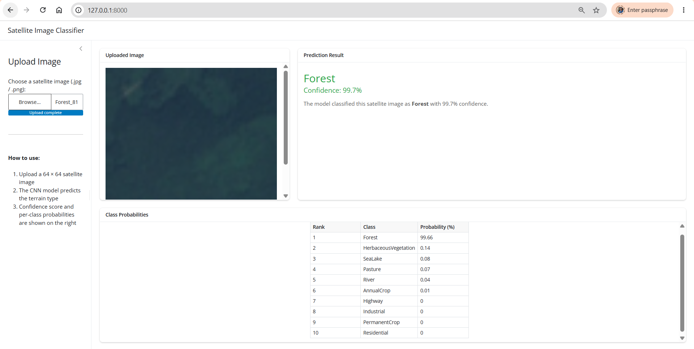

# Satellite Terrain Classification using CNN & PyTorch

---

## # About This Project

Satellite image classification is a genuinely hard and impactful problem. Being able to automatically identify terrain types at scale has direct applications in climate monitoring, agricultural planning, and urban development. This project gave me the opportunity to work hands-on with computer vision, deep learning, and full-stack ML deployment skills that I want to carry into a career in data science and AI.

---

## 1. Executive Summary

Organizations in agriculture, urban planning, environmental monitoring, and disaster response need to classify large volumes of satellite imagery quickly and accurately. Manual classification is slow, expensive, and impossible to scale across thousands of square kilometers.

### The Solution
An end-to-end deep learning pipeline that automatically classifies satellite images into 10 terrain types using a custom Convolutional Neural Network (CNN) built with PyTorch deployable as an interactive web application.

### The Number Impact
| Metric | Value |
|---|---|
| Validation Accuracy | **92.60%** |
| Images Classified | 10,000 |
| Terrain Classes | 10 |
| Model Parameters | 1,241,578 |
| Training Time | ~50 min (CPU) |

---

## 2. Business Problem

Organizations across multiple sectors struggle to process satellite imagery at scale:

- 🌾 **Agriculture** — Monitor crop health, detect annual vs permanent cropland
- 🏙️ **Urban Planning** — Track residential and industrial growth over time
- 🌊 **Environmental** — Monitor deforestation, river changes, and sea/lake boundaries
- 🚗 **Infrastructure** — Detect highway expansion and new construction

Manual analysis by experts is a bottleneck. A single analyst can review hundreds of images per day, an automated model can classify thousands per second.

**The 10 terrain classes this model covers:**

| Class | Class | Class |
|---|---|---|
| AnnualCrop | Forest | HerbaceousVegetation |
| Highway | Industrial | Pasture |
| PermanentCrop | Residential | River |
| SeaLake | | |

### Sample Images from the Dataset


### Pixel Value Distribution (RGB Channels)


### Brightness Distribution by Class


> SeaLake and River classes tend to be darker (lower brightness), while Industrial and Residential areas are brighter, a pattern the model learns to exploit.

---

## 3. Methodology

### Pipeline Overview

```
Raw Satellite Images (64×64 RGB)
        ↓
  Data Preprocessing
  (catalogue, stratified 80/20 split)
        ↓
  Exploratory Data Analysis
  (pixel distributions, brightness per class)
        ↓
  CNN Training
  (augmentation → forward pass → loss → backprop)
        ↓
  Model Evaluation
  (accuracy, confusion matrix, misclassified samples)
        ↓
  Test Set Prediction → submission.csv
        ↓
  Shiny Web App (interactive inference)
```

### CNN Architecture

4 convolutional blocks followed by Global Average Pooling and a 2-layer classifier head. No pretrained weights, trained from scratch.

```
Input (3 × 64 × 64)
  → ConvBlock(3→32)    │ Each block:
  → ConvBlock(32→64)   │ Conv→BN→ReLU→Conv→BN→ReLU
  → ConvBlock(64→128)  │ →MaxPool→Dropout2D
  → ConvBlock(128→256) │
  → GlobalAvgPool
  → Linear(256→256) + ReLU + Dropout
  → Linear(256→10)  ← output logits
```

**Training configuration:**
- Optimizer: Adam (lr=1e-3, weight_decay=1e-4)
- Scheduler: CosineAnnealingLR
- Loss: CrossEntropyLoss
- Early stopping: patience=10 epochs
- Augmentation: horizontal/vertical flip, ±15° rotation, color jitter

---

## 4. Skills

| Category | Tools & Technologies |
|---|---|
| Language | Python 3.12 |
| Deep Learning | PyTorch, torchvision |
| Data Processing | Pandas, NumPy |
| Visualization | Matplotlib, Seaborn |
| Image Processing | Pillow (PIL) |
| ML Utilities | scikit-learn (stratified split, confusion matrix) |
| Web App | Shiny for Python (Express) |

---

## 5. Results & Business Recommendations

### Training & Validation Curves


The model converges smoothly with no signs of severe overfitting. Training and validation loss track closely throughout training.

### Confusion Matrix


The model performs strongly across most classes. Key observations:
- **Forest, SeaLake, Highway, Industrial** — near perfect classification
- **AnnualCrop vs PermanentCrop** — most common confusion (visually similar terrain)
- **HerbaceousVegetation vs Pasture** — occasional misclassification (both green, low-texture)

### Misclassified Samples


### Business Recommendations

**Deploy with high confidence for:**
- Forest monitoring and deforestation tracking
- Sea/lake boundary detection for flood risk assessment
- Industrial and residential zone mapping for urban planning
- Highway and infrastructure detection

**Use with human review for:**
- AnnualCrop vs PermanentCrop distinction (92% accuracy, but fine-grained crop type matters for agricultural policy)
- HerbaceousVegetation vs Pasture classification in low-resolution imagery

---

## 6. Next Steps

- Deploy model to cloud (AWS / GCP) for real-time satellite feed inference
- Expand to multispectral (13-band) EuroSAT for higher accuracy
- Integrate with GIS tools (QGIS, ArcGIS) for geospatial workflows

---

## Project Structure

```
├── project.py               # Code
├── app/
│   ├── app.py                  # Shiny web application
│   └── best_model.pth          # Trained model weights
├── assets/
│   ├── plots/
│   │   ├── random_samples.png
│   │   ├── average_pixel_distribution.png
│   │   ├── average_brightness.png
│   │   ├── training_curves.png
│   │   ├── confusion_matrix.png
│   │   ├── misclassified.png
│   │   └── shiny_screenshot.png
│   └── weights/
│       └── best_model.pth
└── submission.csv              # Test set predictions for challenge server
```

---

## Web Application

The model is wrapped in an interactive Shiny web app. Upload any satellite image and get an instant prediction with confidence score and full class probability breakdown.

### App Screenshot



> In the example above, the model correctly identifies a **Forest** image with **99.7% confidence** — with the probability table showing near-zero scores for all other classes.

### How to Run Locally

```bash
pip install shiny torch torchvision pillow pandas numpy
cd app
python -m shiny run app.py
```

Open `http://127.0.0.1:8000` in your browser.

---

